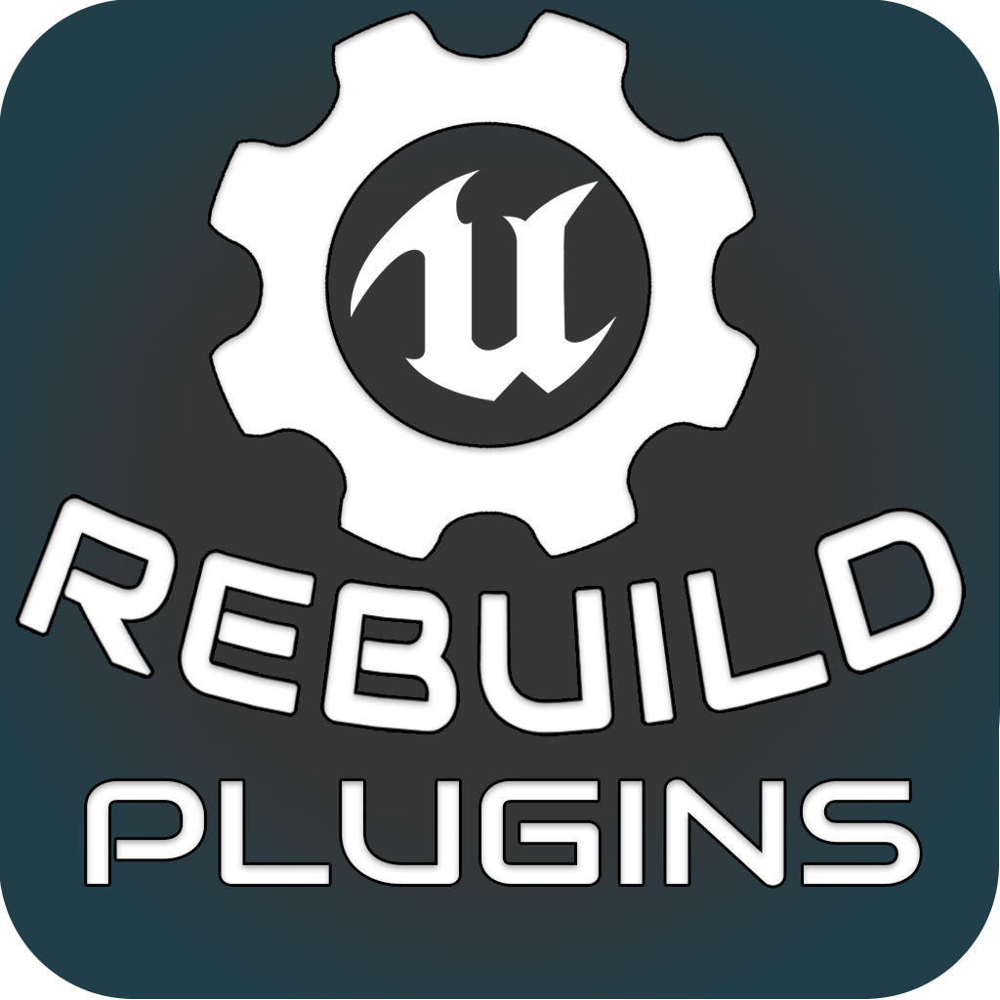

# Plugin Manager



## Description

**Plugin Manager** is a user-friendly graphical application for managing, building, and archiving plugins for Unreal Engine. The application provides an intuitive interface for selecting plugin folders, importing plugins from ZIP archives, choosing the engine version, and automatically building plugins with subsequent log archiving.

## Features

- **Plugin Selection and Importing:**
  - Choose a folder containing plugins for import.
  - Import plugins from ZIP archives.

- **Plugin Management:**
  - View a list of imported plugins with icons and version information.
  - Ability to remove plugins from the list.

- **Plugin Building:**
  - Select the Unreal Engine version for plugin building.
  - Automatic building of selected plugins with progress display.
  - Plugin blocks change color based on build results (success or error).

- **Logging:**
  - Detailed logging of user actions, system events, and build information.
  - Archiving of logs upon application closure if an archive for the current date does not exist.

- **Multilingual Support:**
  - Support for multiple interface languages (Russian and English).
  - Ability to switch languages in real-time.

## Requirements

- **Operating System:** Windows, macOS, Linux
- **Python:** 3.7 or higher
- **Required Libraries:**
  - `tkinter` (usually included in the Python standard library)

## To Building

  ```bash
  pyinstaller --onefile --windowed --icon=public/icon.ico --add-data "locales/*.json;locales" --add-data "public/*.png;public" --add-data "public/*.gif;public" main.py

## Installation

1. **Clone the Repository:**

   ```bash
   git clone https://github.com/your-repository/plugin-manager.git
   cd plugin-manager
